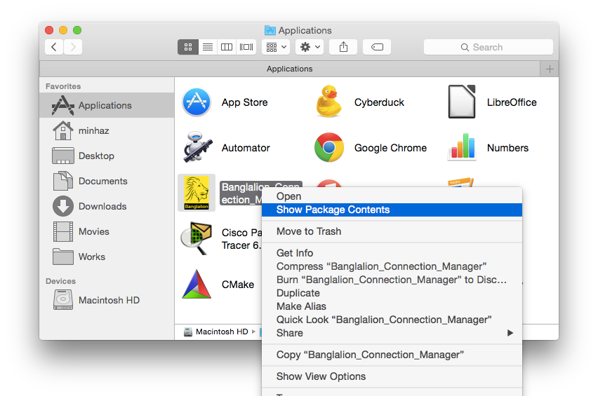
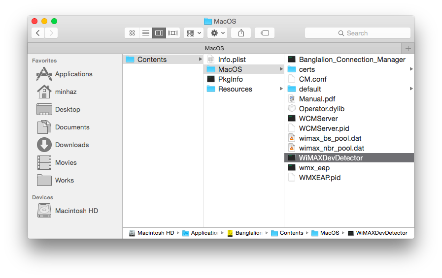
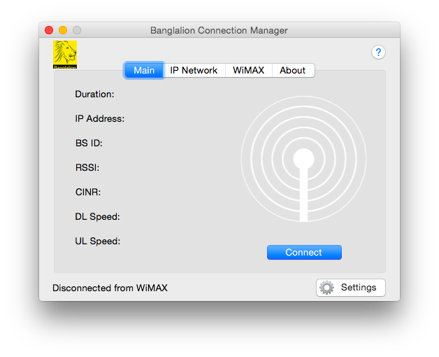
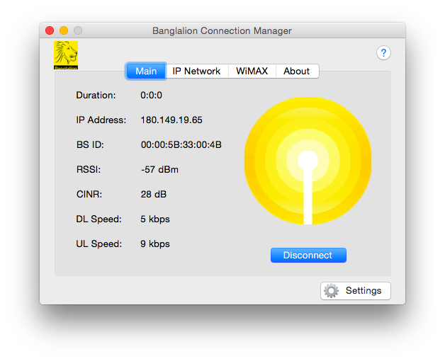
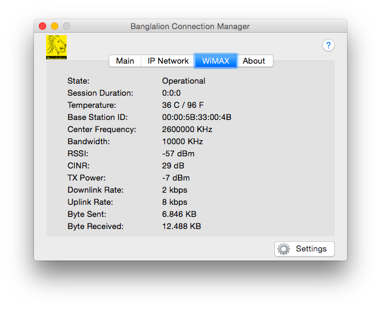
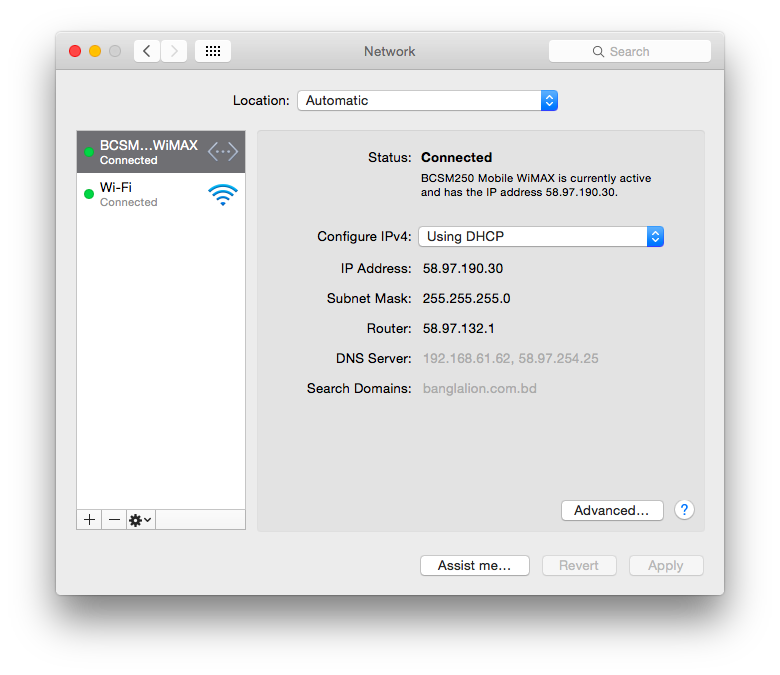
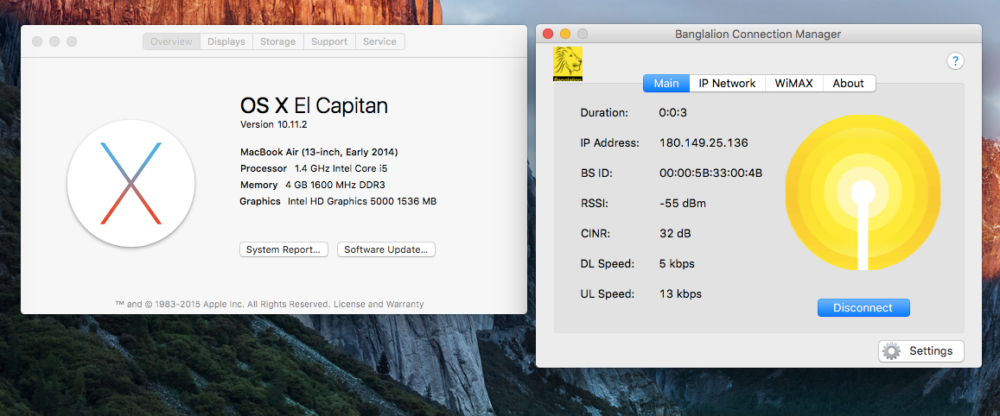

# Banglalion WiMAX on Mac OS X

## Run Banglalion WiMAX devices on Mac OS X 64bit (With El Capitan Fix)

### Before You Begin

This guide is unofficial, not verified or authorized by [Banglalion
Communications Ltd.](http://banglalion4g.com/) You must accept that I will not
be responsible for any kind of loss to your device or computer. You will need
a Mac with OS X 10.5 or later installed.

### Special Thanks

Thanks to [Rafat Touqir Rafsun](https://plus.google.com/+RafatTouqirRafsun)
for the suggestion of using `WiMAXDevDetector` tool.

Thanks to [Ujjal Suttra Dhar](http://ujjal.net) for reporting that other
devices are working perfectly.

### Downloads

Get the file [WiMAXCMInst.zip](files/WiMAXCMInst.zip)

### Supported Devices

  * WU216
  * WIXUBB216
  * AX226

### Special Notes for El Capitan users

If you are using OS X 10.11 or newer, you need to disable Apple's System
Integrity Protection.

  * Reboot OS X in Recovery Mode by by restarting while holding CMD(⌘)+R key
  * Open Utility > Terminal
  * Run the command `csrutil disable`
  * Reboot OS X in normal mode

### Install

Extract the file WiMAXCMInst.zip and run **WiMAXCMInst.mpkg** bundle. You will
be prompted to enter your account password for administrative access. After
installing Restart your mac and plug in the modem.

### But the Device Doesn't Showing up?

There has been a massive changes to Mac OS X since the release of version
10.8. So you need to do some trick to make the device load its firmware. Run
the following line in a terminal
`/Applications/Banglalion_Connection_Manager.app/Contents/MacOS/WiMAXDevDetector`
and then the device LED shoud lit up.

Alternatively you can start the WiMAXDevDetector manually.

Go to `Applications` from `Finder`, right click
`Banglalion_Connection_Manager.app` and click `Show package contents`.

Then go to `Banglalion_Connection_Manager.app/Contents/MacOSX/` and run
`WiMAXDevDetector`. Your device LED should change its color depending on the
model. For me, it turned into green.

Run the application `Banglalion_Connection_Manager`, Click `Settings` and fill
up your username and password.

If the username and password is both correct, your device should be connected
to the internet. If not, it may be network issue or you entered a wrong
username and password combination.

`Info` tab inside the connection manager application.

Even the device is shown up at Network with the alias `BCSM250 Mobile WiMAX`.

### On El Capitan...

### Video

### F.A.Q.

Q: If I get the modem AirStream 1100 F25, will it work on Mavericks or
Yosemite?  
A: No. I own a AirStream 1100 F25, it doesn't work on Mac OS X 10.8 or later.
Apple removed the RNDIS feature from Mac years ago. It doesn't support USB CDC
ACM devices since Yosemite. If you have any workaround to make this device
work on OS X 10.10+, let me know via comment below.  
---  
Q: Do I need to boot my Mac into 32-bit mode?  
A: No. This solution works on 64-bit perfectly.  
Q: Does it work on Mavericks or Mountain Lion or Yosemite or El Capitan or
**Sierra**?  
A: The installer claims that it will run on Mac 10.5+. I tested it on Mac OS X
10.10, 10.11 and 10.12, works like a charm.  
Q: I have a question that is not listed here.  
A: Please comment to this post's Disqus thread.  
  
Please enable JavaScript to view the [comments powered by
Disqus.](https://disqus.com/?ref_noscript)

Banglalion WiMAX on Mac OS X maintained by [Md. Minhazul
Haque](http://mdminhazulhaque.com/)

